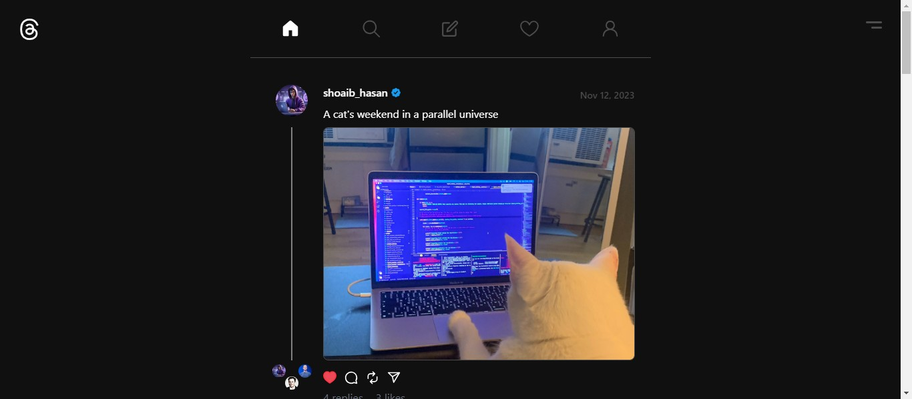

# Threads - Social Media Application Clone

Welcome to Threads, a social media application clone that allows users to share posts, interact with other users, and personalize their experience with dark and light modes. Threads offers full user authentication, including login, logout, signup, and password management features. Users can create, edit, and delete posts, view other users' posts, like and comment on posts, and can repost other user's post and follow/unfollow other users.

## 🌐 Live Preview

Checkout Live Preview by clicking the image below:

[](https://threads-clone-two-pink.vercel.app/)


## Demo Video

Check out the demo video of Threads in action: [Demo Video](#)

## 💻 Tech Stack

- **Frontend:**
  - React (for creating user interface)
  - React Router DOM
  - Redux (for state management)
  - Tailwind CSS (for styling)
  - Axios (for handling HTTP requests)
  - React Hot Toast (for displaying notifications)
  - React Loader Spinner (for loading components)
  - React Icons
  - React Helmet (for dynamic title)
  - Javascript Time Ago


- **Backend:**
  - Node.js
  - Express.js
  - MongoDB (database)
  - Mongoose (ODM)
  - Bcrypt.js (for password hashing)
  - JWT (JSON Web Tokens) for authentication
  - Crypto
  - Nodemailer
  - Canvas
  - Multer
  - Cloudinary
  - Cookie Parser
  - CORS
  - Dotenv


## Features

- **User Authentication:**
  - Signup with username, email and password
  - Login with username or email and password
  - Logout
  - Forgot password (using Nodemailer)

- **Post Management:**
  - Create new posts
  - Edit existing posts
  - Delete posts
  - View other users' posts

- **Interactions:**
  - Like posts
  - Comment on posts
  - Follow/unfollow other users
  - View post likes and comments
  - Share or Repost other user's post

- **Themes:**
  - Dark mode
  - Light mode

- **Responsive Design:**
  - Mobile-friendly layout


## Project Structure

The project is organized with a clear structure, separating the backend and frontend components:


### Backend
- **server/**
  - **config/**
    - `db.js`: Database configuration.
  - **controller/**
   - `auth.controller.js`: Authetication-related logic.
    - `user.controller.js`: User-related logic.
    - `post.controller.js`: Post-related logic.

  - **middleware/**
     - `asyncHandler.middleware.js`: Promise Handler middleware.
    - `auth.middleware.js`: Authentication middleware.
    - `error.middleware.js`: Error handling middleware.
    - `multer.middleware.js`: Middleware for file uploads.
  - **models/**
    - `user.model.js`: User data model.
    - `post.model.js`: Post data model.

  - **route/**
    - `user.route.js`: User API routes.
    - `post.route.js`: Post or Threads API routes.

  - **uploads/**
    (Assuming for file uploads)

  - **util/**
    - `error.util.js`: Error handling utilities.
    - `email.util.js`: Email-related utilities.
    - `avatar.util.js`: Utilities for handling avatars.
    - `template.util.js`: Template-related utilities.
  - `server.js`: The main server file.
  - `app.js`: Express application configuration.
  - `.env`: Environment variables.
  - `.env.example`: Example environment variables.
  - `package.json`: Backend dependencies.

### Frontend
- **client/**
  - **src/**
    - **assets/**
    - **components/**
    - **helpers/**
    - **hooks/**
    - **layouts/**
    - **pages/**
    - **store/**
    - `App.jsx`: React application entry point.
    - `index.css`: Global styles.
    - `main.jsx`: Main React component.
    - ...
  - `.env`: Environment variables.
  - `.env.example`: Example environment variables.
  - `.gitignore`: Git ignore file.
  - `index.html`: HTML entry point.
  - `package.json`: Frontend dependencies.


## Getting Started

Follow these steps to set up the project on your local machine:

1. **Clone the repository**:
   ```bash
   git clone https://github.com/shoaibhasann/threads-clone.git
   ```

2. **Set up the backend**:
   - Navigate to the `server` folder.
   - Install dependencies: `npm install`
   - Set up environment variables: Create a `.env` file based on `.env.example.js`.
   - Start the backend server: `npm start`

3. **Set up the frontend**:
   - Navigate to the `client` folder: `cd client`
   - Install dependencies: `npm install`
   - Set up environment variables: Create a `.env` file based on `.env.example.js`.
   - Start the client development server: `npm run dev`

4. **Access the application**:
   Open your browser and visit: [http://localhost:5173](http://localhost:5173)

Made with ❤️ by Shoaib Hasan

